# Prefabs

This document outlines how to make your own prefabs.

Instead of simple geometry the plugin can use authored models aka prefabs for placing geometry.

## Base Models

There are 4 base models. All of them should be contained within a (0.5 x 0.5 x 0.5) block

### Flat
Just flat ground. Although it can be reduced to two triangles, the results often look better with subdivided faces.

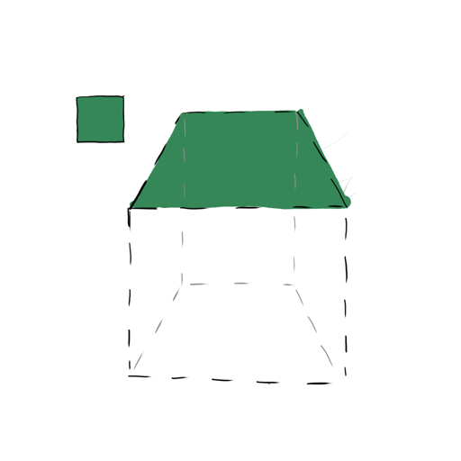

### Diagonal Ledge

Diagonal ledge; should not cross the diagonal on the connecting edges

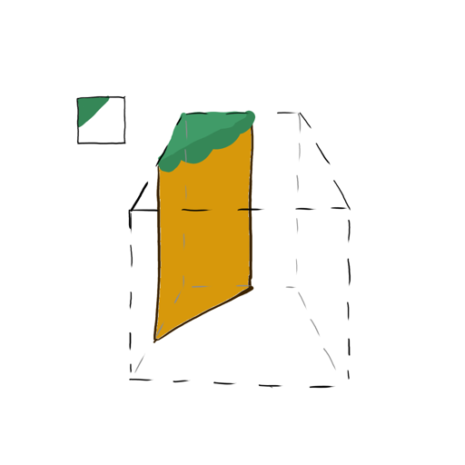

### Orthogonal Ledge

Orthogonal ledge

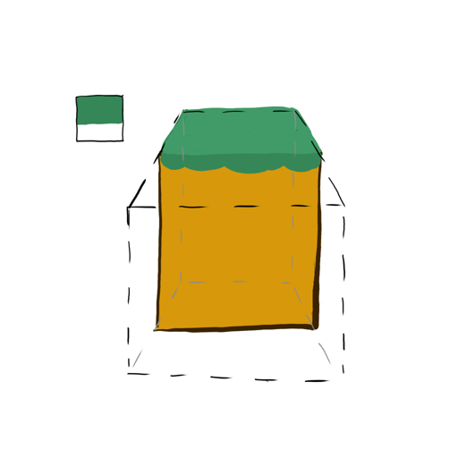

### Diagonal Filler

Filler sandwitched between two diagonal tiles; the red part should be a separate part

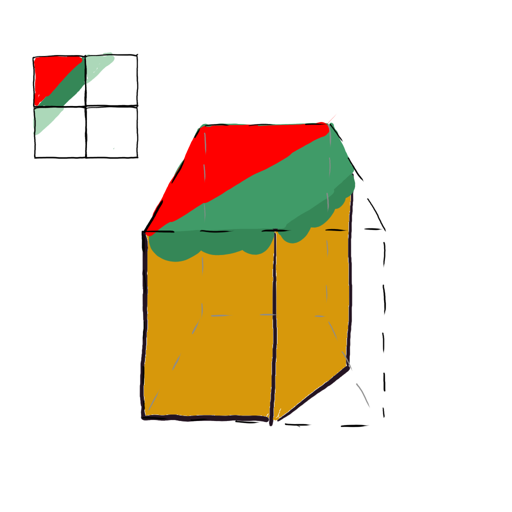

## Texturing and UV mapping

A huge advantage of prefabs is the possibility to use a texture/color map to add details.
Every part of the prefab can be textured. The same alignment and seeming rules apply as with
geometry.

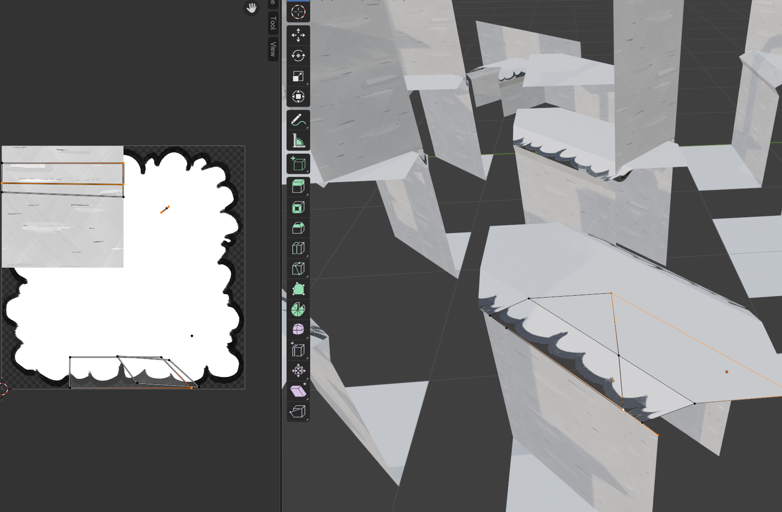
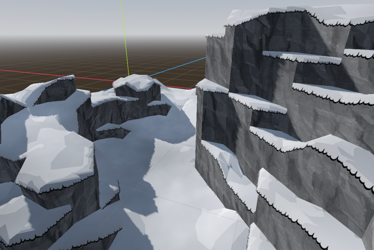

UV1 are used as a color map. UV2 can be used to mark a ledge or ridge. The y-values denote closeness to the ledge,
with 1.0 being right on the ledge, and 0.0 not near a ledge. The x-values denote the same for a ridge.

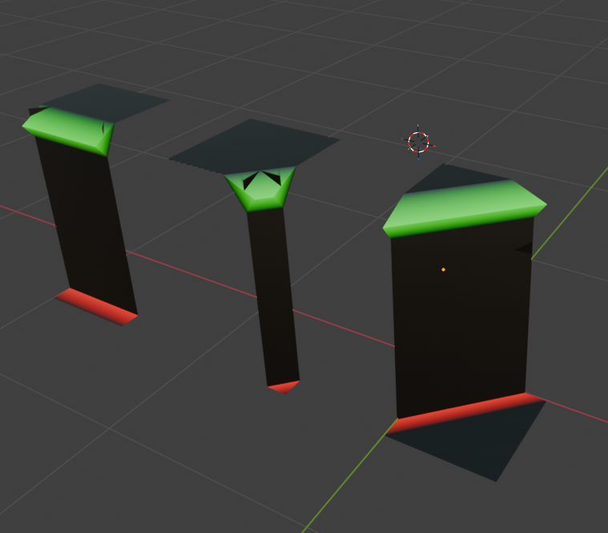

Note: In Blender the origin of an image is the bottom left. In Godot it is the top left. For that reason the y-values
in Blender appear to be flipped i.e. Godot's UV.y = 1.0 - Blender's Uv.y

## Walls

There are two types of wall cells. A top wall and a mid/regular wall. A wall is generated top down.
To ensure there are no gaps, wall-cells operate on a global grid.

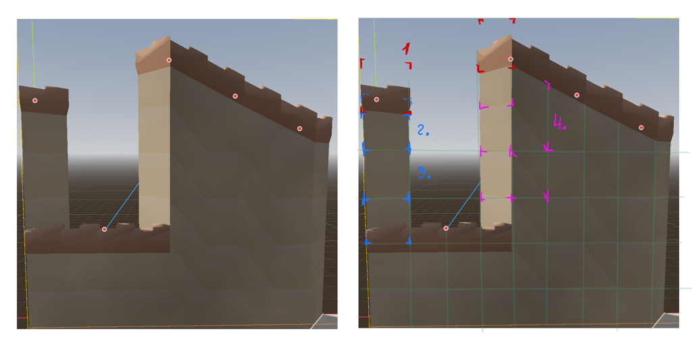

1. First the top floor is placed at the height specified by the height map. Disregarding the grid.
2. A top wall is placed below the top floor. The upper parts snap to the floor, while the lower parts snap to the grid
3. Until another floor is reached, regular walls are placed below, each one snapping to the grid
4. In some cases, when the heightmap slopes, the left and right parts can snap at a different height. This results in skewed geometry

For tiling this means: 
- each top-type wall needs to attach seemlessly to the tops of regular-type walls
- top-type walls need to attach seemlessly to the sides of other top-type walls
- Each regular-type wall needs to attach seemlessly to the tops of other regular-type walls
- regular-type walls need to attach seemlessly to the sides of other regular type walls

## Caps

On the edges of prefabs, gaps might occur. To close those gaps cap geometry must be provided.
There are two types of caps:
   1. Floor caps: close off gaps of floors to their side.
   2. Wall caps: close off gaps from a floor to a wall placed on top of it

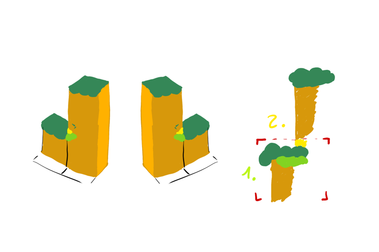

### Orthogonal Ledge

The Orthogonal ledge needs caps when a Orthogonal ledge is adjacent to a higher Orthogonal ledge.

- Left Floor
- Left Wall
- Right Floor
- Right Wall

### Filler

#### Diagonal-Diagonal

Two diagonal walls meet at a 90° angle

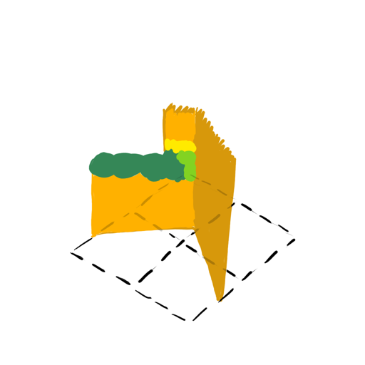

- Diagonal-Diagonal Cap Left Floor
- Diagonal-Diagonal Cap Right Floor
- Diagonal-Diagonal Cap Left Wall
- Diagonal-Diagonal Cap Right Wall

#### Diagonal-Orthogonal

A diagonal continues with a Orthogonal ledge forming a 135° angle

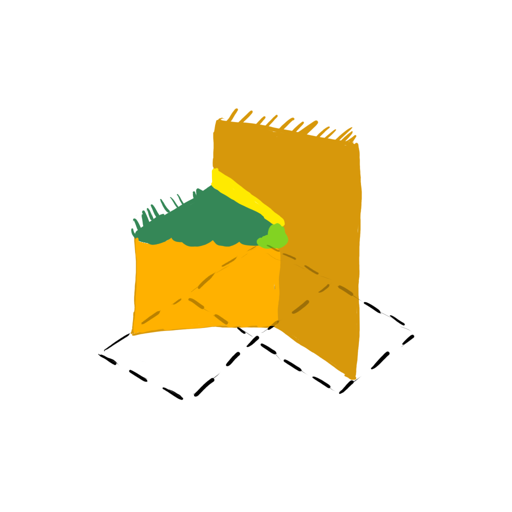

- Diagonal-Orthogonal Cap Left Floor
- Diagonal-Orthogonal Cap Right Floor
- Diagonal-Orthogonal Cap Left Wall
- Diagonal-Orthogonal Cap Right Wall

## List of all pieces

### Flat

    - Flat full
    - Flat half

### Diagonal

    - Top Floor
    - Bottom Floor
    - Wall Top
    - Wall

### Orthogonal

    - Top Floor
    - Bottom Floor
    - Wall Top
    - Wall
    - Orthogonal-Straigt Cap Left Floor
    - Orthogonal-Straigt Cap Left Wall
    - Orthogonal-Straigt Cap Right Floor
    - Orthogonal-Straigt Cap Right Wall

### Filler

    - Top Floor
    - Half Floor
    - Bottom Floor
    - Wall Top
    - Wall
    - Diagonal-Diagonal Cap Left Floor
    - Diagonal-Diagonal Cap Right Floor
    - Diagonal-Diagonal Cap Left Wall
    - Diagonal-Diagonal Cap Right Wall
    - Diagonal-Orthogonal Cap Left Floor
    - Diagonal-Orthogonal Cap Right Floor
    - Diagonal-Orthogonal Cap Left Wall
    - Diagonal-Orthogonal Cap Right Wall

## Resources

To organize the prefabs two resource types are used:
 - Prefab Set
 - Prefab

### Prefab Set

A prefab set, just like a tile set in 2D, groups fitting prefabs. It has an array for the 4 different prefab types.
Each time the generator requests a prefab of a given type, one is selected at random.

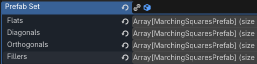

### Prefab

A prefab resource is a group of all parts of the whole prefab. This is simply asigning exported models to the corresponding
resource exports.

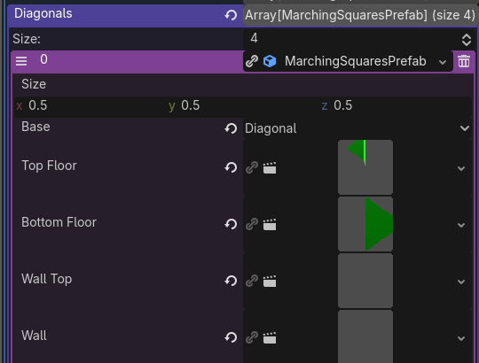

Note: due to current limitations of GDscripts type systems
it is possible to add a prefab of wrong type to the prefab set.
Be careful not to do that!

## Examples and templates

If you can't quite imagine it all, it's best to look at the examples. There is a blender-file that serves as a template.
It includes linked-geometry "test cases". You can edit them in place there. Since the geometry is linked, the pieces themselves
will update automatically.

When done you can then simply export all the pieces and create the resource files described in the previous section. 
I would recomend [this blender extension](https://extensions.blender.org/add-ons/superduperbatchexporter/).

### Screenshot time

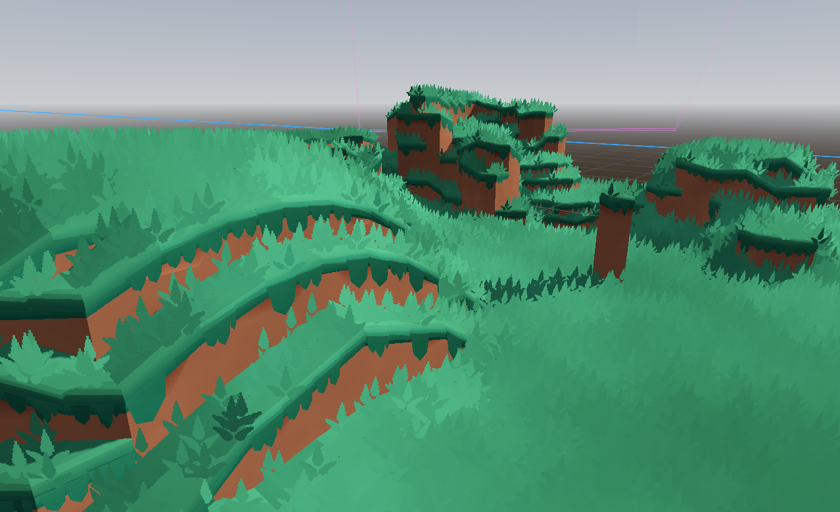

